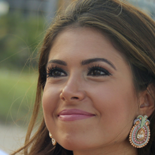

# CVLFace: High-Performance Face Recognition All-in-One Toolkit


## 🖼️  Introduction

CVLFace is a powerful and versatile toolkit for achieving state-of-the-art performance in face recognition.  Whether you're a researcher exploring new algorithms or a developer building real-world applications, CVLFace empowers you with:

* **Blazing Fast Multi-GPU Training:**  Train industry-leading face recognition models with lightning speed, leveraging the power of multiple GPUs for unparalleled efficiency.
* **Pre-trained Models at Your Fingertips:** Access a collection of pre-trained models (from Hugging Face Hub) ready to be integrated into your projects, saving you time and effort.
* **Comprehensive Evaluation Capabilities:**  Thoroughly evaluate your models on a wide range of benchmark datasets, including LFW, CPFLW, CFPFP, CALFW, AGEDB, IJBB, IJBC, and TinyFace, all with the speed of multi-GPU processing.
* **Using face recognition models as loss functions for other tasks:**  Utilize face recognition models as auxiliary loss functions for other tasks, such as training ID consistent face generation models (e.g. [DCFace](https://arxiv.org/pdf/2304.07060))

**CVLFace is created by [MSU CVLab](https://cvlab.cse.msu.edu/) to foster innovation, collaboration, and accessibility in the field of face recognition. It is built upon a foundation of cutting-edge research and technology, offering a user-friendly experience for both beginners and seasoned practitioners.**

**Visit our Documentation for more details: [Documentation Website](https://mk-minchul.github.io/CVLface)** 

## 💪 Features

### 🚀  High-Performance Training and Evaluation:

* **Multi-GPU Training:**  Leverage the power of multiple GPUs for significantly faster training times, allowing you to iterate through experiments and achieve state-of-the-art results with greater efficiency.
* **Multi-GPU Evaluation:**  Conduct large-scale evaluation on benchmark datasets with unparalleled speed. 
* **Flexible Configuration:**  Customize training and evaluation parameters to fine-tune your model for optimal performance on specific tasks and datasets.


### 📦 Pre-trained Models:

* **Ready-to-Use Models:**  Get started quickly with our collection of pre-trained models from Hugging Face Hub.  These models are trained on massive datasets and are ready to be deployed in your applications.
* **Support for Diverse Architectures:**  Explore a range of popular face recognition architectures, including IR18, IR50, IR101, ViT, PartFViT, ViT-Swin, ViT-KP-RPE and more to find the best fit for your specific needs.
* **Models Uploaded to Huggingface🤗 for easy usage** : [pretrained_models/README.md](cvlface/pretrained_models/README.md)


### 🏆 State-of-the-Art Performance:

* **Achieve Industry-Leading Results:** CVLFace is designed to deliver top-tier accuracy on challenging face recognition tasks.
* **Supported Papers:** CVLFace seamlessly integrates with widely-cited face recognition algorithms, such as such as ArcFace, CosFace, AdaFace, and KP-RPE. 

   * [1] [KP-RPE: KeyPoint Relative Position Encoding for Face Recognition](https://arxiv.org/abs/2403.14852)
   * [2] [AdaFace: Quality Adaptive Margin for Face Recognition](https://arxiv.org/abs/2204.00964)
   * [3] [ArcFace: Additive Angular Margin Loss for Deep Face Recognition](https://arxiv.org/abs/1801.07698)
   * [4] [CosFace: Large Margin Cosine Loss for Deep Face Recognition](https://arxiv.org/abs/1801.09414)
* **Performance Board** : [pretrained_models/README.md](cvlface/pretrained_models/README.md)

| Arch          | Loss         | Dataset    | Link                                                                           | AVG   | LFW   | CPFLW | CFPFP | CALFW | AGEDB | IJBB@0.01 | IJBC@0.01 | TinyFace R1 | TinyFace R5 |
|---------------|--------------|------------|--------------------------------------------------------------------------------|-------|-------|-------|-------|-------|-------|-----------|-----------|-------------|-------------|
| ViT KPRPE [1] | AdaFace [2]  | WebFace12M | [🤗](https://huggingface.co/minchul/cvlface_adaface_vit_base_kprpe_webface12m) | 93.13 | 99.82 | 95.65 | 99.30 | 95.93 | 98.10 | 96.55     | 97.82     | 76.10       | 78.92       |
| ViT KPRPE [1] | AdaFace [2]  | WebFace4M  | [🤗](https://huggingface.co/minchul/cvlface_adaface_vit_base_kprpe_webface4m)  | 92.76 | 99.83 | 95.40 | 99.01 | 96.00 | 97.67 | 95.56     | 97.13     | 75.75       | 78.49       |
| ViT       [1] | AdaFace [2]  | WebFace4M  | [🤗](https://huggingface.co/minchul/cvlface_adaface_vit_base_webface4m)        | 92.48 | 99.80 | 94.97 | 98.94 | 96.03 | 97.48 | 95.60     | 97.14     | 74.79       | 77.58       |
| IR101     [3] | AdaFace [2]  | WebFace12M | [🤗](https://huggingface.co/minchul/cvlface_adaface_ir101_webface12m)          | 92.13 | 99.82 | 94.57 | 99.24 | 96.12 | 98.00 | 96.46     | 97.72     | 72.42       | 74.81       |
| IR101     [3] | AdaFace [2]  | WebFace4M  | [🤗](https://huggingface.co/minchul/cvlface_adaface_ir101_webface4m)           | 91.98 | 99.83 | 94.63 | 99.27 | 96.05 | 97.90 | 96.10     | 97.46     | 72.13       | 74.49       |
| IR101     [3] | Arc-Face [3] | WebFace4M  | [🤗](https://huggingface.co/minchul/cvlface_arcface_ir101_webface4m)           | 91.76 | 99.78 | 94.35 | 99.21 | 96.00 | 97.95 | 95.83     | 97.30     | 71.03       | 74.41       |
| IR101     [3] | AdaFace [2]  | MS1MV3     | [🤗](https://huggingface.co/minchul/cvlface_adaface_ir101_ms1mv3)              | 90.99 | 99.83 | 93.92 | 99.09 | 96.02 | 98.18 | 95.82     | 97.05     | 67.95       | 71.03       |
| IR101     [3] | AdaFace [2]  | MS1MV2     | [🤗](https://huggingface.co/minchul/cvlface_adaface_ir101_ms1mv2)              | 90.90 | 99.80 | 93.53 | 98.61 | 96.12 | 98.05 | 95.59     | 96.81     | 68.11       | 71.49       |
| IR50      [3] | AdaFace [2]  | MS1MV2     | [🤗](https://huggingface.co/minchul/cvlface_adaface_ir50_ms1mv2)               | 89.96 | 99.85 | 92.85 | 98.09 | 96.07 | 97.85 | 94.86     | 96.20     | 64.99       | 68.88       |
| IR50      [3] | AdaFace [2]  | WebFace4M  | [🤗](https://huggingface.co/minchul/cvlface_adaface_ir50_webface4m)            | 91.48 | 99.78 | 94.17 | 98.99 | 95.98 | 97.78 | 95.49     | 97.01     | 70.20       | 73.93       |
| IR50      [3] | AdaFace [2]  | CASIA      | [🤗](https://huggingface.co/minchul/cvlface_adaface_ir50_casia)                | 77.43 | 99.37 | 90.02 | 97.04 | 93.43 | 94.40 | 46.04     | 52.97     | 59.44       | 64.14       |
| IR18      [3] | AdaFace [2]  | WebFace4M  | [🤗](https://huggingface.co/minchul/cvlface_adaface_ir18_webface4m)            | 89.55 | 99.58 | 92.28 | 97.80 | 95.52 | 96.48 | 92.75     | 94.79     | 66.07       | 70.71       |
| IR18      [3] | AdaFace [2]  | VGG2       | [🤗](https://huggingface.co/minchul/cvlface_adaface_ir18_vgg2)                 | 88.12 | 99.53 | 91.73 | 97.64 | 93.90 | 94.07 | 90.07     | 92.40     | 64.62       | 69.15       |
| IR18      [3] | AdaFace [2]  | CASIA      | [🤗](https://huggingface.co/minchul/cvlface_adaface_ir18_casia)                | 72.40 | 99.22 | 87.00 | 94.93 | 92.65 | 92.68 | 30.36     | 37.10     | 56.20       | 61.43       |


### 📱 Useful Apps:

CVLFace includes several practical apps to demonstrate and utilize the capabilities of the toolkit in real-world scenarios. Currently, there are two main applications:

#### 1. [Face Alignment App](cvlface/apps/face_alignment/README.md)
The Face Alignment App processes facial images to align them to a canonical position suitable for face recognition. This app automatically resizes the images to 112x112 pixels, optimizing them for consistent input to face recognition models. 


<table align="center">
<tr>
<td></td>
<td></td>
<td></td>
</tr>
</table>

#### 2. [Face Verification App](cvlface/apps/verification/README.md)
The Face Verification App verifies the identity of a person by comparing their facial image with a reference image. This app uses a pre-trained face recognition model to calculate the similarity between the two images and determine if they belong to the same person.

<table align="center">
<tr>
<td></td>
</tr>
</table>


## 💻 Easy Installation

### 1. Install dependencies
```bash
conda create -n cvlface python=3.10 pytorch=2.1.2 torchvision=0.16.2 torchaudio=2.1.2 pytorch-cuda=12.1 -c pytorch -c nvidia
git clone https://github.com/mk-minchul/CVLface.git
cd CVLface
pip install -r requirements.txt
```

### 2. Set up environment variables at `CVLface/cvlface/.env`
Modify the following environment variables in the `.env` file:
```bash
cd cvlface
vim .env # edit the following environ variables

"""(content to add to .env)
DATA_ROOT="YOUR_PATH_TO_DATA"
HF_TOKEN="YOUR_HUGGINGFACE_HF_TOKEN"
WANDB_TOKEN="YOUR_WANDB_TOKEN"
"""
```

### 3. Easy Downloading of Evaluation Toolkit (Optional)
**Download Evaluation Toolkit** for evaluating models during training or after training.
Take a look at [README_EVAL_TOOLKIT.md](cvlface/data_utils/recognition/eval_data/README_EVAL_TOOLKIT.md) for details.


### 4. Easy Downloading of Pretrained models (Optional)
Take a look at [README_MODELS.md](README_MODELS.md) for details. We offer more than 10 pre-trained models.


### 5. Easy Downloading of Training Datasets (Optional)
Take a look at [README_TRAIN_DATA.md](cvlface/data_utils/recognition/training_data/README_TRAIN_DATA.md) for details.
Documented datasets include 
- CASIA-WebFace
- VGG2
- MS1MV2
- MS1MV3
- WebFace4M
- WebFace12M

## 🏃‍♀️ Usage


#### Quick Test
Quickly test if the installation is successful by running the following command:
(No training dataset needed for the mock run, only needs the eval toolkit)

```bash
# mock run to test the installation and evaluation toolkit
cd cvlface/research/recognition/code/run_v1
python train.py trainers.prefix=test_run \
      trainers.num_gpu=1 \
      trainers.batch_size=32 \
      trainers.limit_num_batch=128 \
      trainers.gradient_acc=1 \
      trainers.num_workers=8 \
      trainers.precision='32-true' \
      trainers.float32_matmul_precision='high' \
      dataset=configs/synthetic.yaml \
      data_augs=configs/basic_v1.yaml \
      models=iresnet/configs/v1_ir50.yaml \
      pipelines=configs/train_model_cls.yaml \
      evaluations=configs/base.yaml \
      classifiers=configs/fc.yaml \
      optims=configs/step_sgd.yaml \
      losses=configs/cosface.yaml
```


#### Multi-GPU Training

```bash
# mock run to test the installation and evaluation toolkit
cd cvlface/research/recognition/code/run_v1
LIGHTING_TESTING=1 CUDA_VISIBLE_DEVICES=0,1,2,3,4,5,6 lightning run model \
    --strategy=ddp \
    --devices=7 \
    --precision="32-true" \
      train.py trainers.prefix=ir101_WF4M_adaface \
      trainers.num_gpu=7 \
      trainers.batch_size=256 \
      trainers.gradient_acc=1 \
      trainers.num_workers=8 \
      trainers.precision='32-true' \
      trainers.float32_matmul_precision='high' \
      dataset=configs/webface4m.yaml \
      data_augs=configs/basic_v1.yaml \
      models=iresnet/configs/v1_ir101.yaml \
      pipelines=configs/train_model_cls.yaml \
      evaluations=configs/full.yaml \
      classifiers=configs/fc.yaml \
      optims=configs/step_sgd.yaml \
      losses=configs/adaface.yaml \
      trainers.skip_final_eval=False
```

More examples can be found at [cvlface/research/recognition/code/run_v1/scripts/examples](cvlface/research/recognition/code/run_v1/scripts/examples)

## 🤝 Contributing

We encourage contributions to CVLFace, including:

* **Bug Reports:**  Help us identify and fix any issues you encounter.
* **Feature Requests:**  Suggest improvements or new features that would enhance the toolkit.
* **Code Contributions:**  Contribute directly to the development of CVLFace by submitting pull requests.

## 🚀  Acknowledgments

We would like to express our gratitude for their contributions and support:

* [MSU CVLab](https://cvlab.cse.msu.edu/)
* [MSU PRIP Lab](https://biometrics.cse.msu.edu/)
* [MSU iProbe Lab](https://iprobe.cse.msu.edu/)


**Join us in pushing the boundaries of face recognition technology with CVLFace!**
