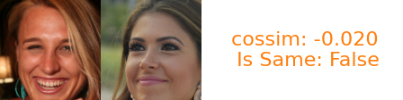

# Verification App 

## Overview
This verification app is designed to compare pairs of images and verify certain criteria or conditions between them. The app requires a structured directory containing the images and a CSV file that specifies which images should be compared.

## Directory Structure
Ensure that your project directory is structured as follows:
```
example/
│
├── images/            # Directory containing all the images listed in pairs.csv
│   ├── 0.jpg
│   ├── 1.jpg
│   ├── 2.png
│   ├── 3.png
│   ├── 4.png
│   ├── 5.png
│
└── pairs.csv          # CSV file listing pairs of images to be compared
```

## File Format

The `pairs.csv` file should contain two columns, `A` and `B`, listing the filenames of the images to be compared. The file should look like this:
```
,A,B
0,0.jpg,1.jpg
1,2.png,3.png
2,4.png,5.png
```

## Usage
1. Prepare your images and the `pairs.csv` as described in the directory structure.
2. Run the script using the following command:
```bash
python verify.py --data_root ./example
```

3. you can optionally change the recognition model by passing `--recognition_model_id` argument. 
Find the available recognition models in [cvlface/pretrained_models/README.md](../../pretrained_models/README.md)

### Expected Results
After running the script, the results will be saved under the `example` directory. Ensure that the script has write permissions to create or modify files in this directory.

- CSV File 

| index | A | B | is_same | cossim |
| --- | --- | --- | --- | --- |
| 0 | 0.jpg | 1.jpg | TRUE | 0.67149448 |
| 1 | 2.png | 3.png | FALSE | -0.0197442 |
| 2 | 4.png | 5.png | FALSE | 0.05260294 |

- Visualization

<table align="center">
<tr>
<td></td>
</tr>
<tr>
<td></td>
</tr>
<tr>
<td></td>
</tr>
</table>

## Troubleshooting
If you encounter any issues:
- Check that the `pairs.csv` file is formatted correctly.
- Ensure all images listed in the `pairs.csv` are present in the `images` directory and that there are no typos in the filenames.

