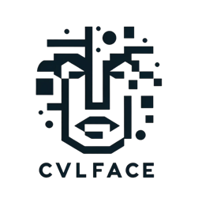

# CVLface <small>1.0.1</small>

> A all-in-one face recognition research platform.

- Simple and extendable
- Adopts modern frameworks (Lightning, PyTorch, Huggingface, Wandb, etc.)
- Easy to use (download models and datasets on the fly)
- Managed by CVL of MSU

[About Us](https://cvlab.cse.msu.edu/)
[GitHub](https://github.com/mk-minchul/CVLface)
[Getting Started](#CVLface)